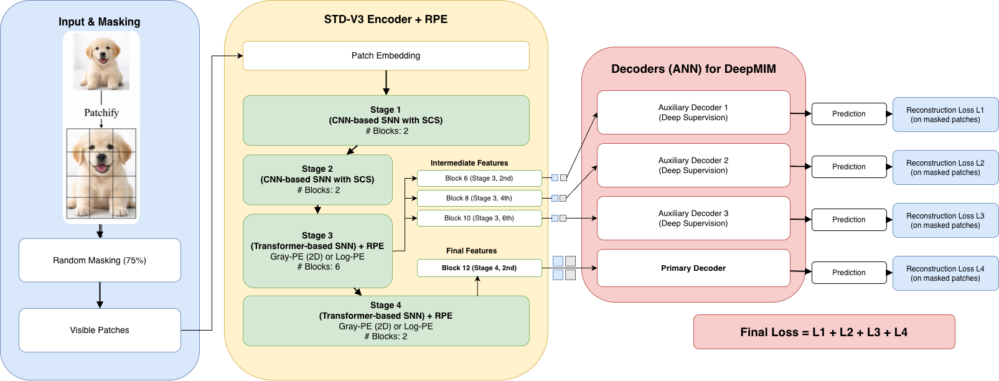

# DeepMIM + SDT V3: Master Thesis Project

This repository contains my master thesis implementation and experiments based on Spike Driven Transformer V3 and DeepMIM style self supervised pretraining for spiking vision transformers.

The original SDT V3 codebase is used as the foundation. My work extends this foundation with thesis specific model variants, self supervised pretraining components, attention mechanism experiments, linear probing, fine tuning pipelines, and downstream transfer scripts.

The goal of this repository is to make my own contributions clearly visible for academic, technical, and portfolio purposes.

## Architecture Overview

The following diagram summarizes the DeepMIM and SDT V3 encoder architecture used in this thesis project.

## Project Context

Spiking Neural Networks aim to provide energy efficient alternatives to conventional artificial neural networks. Transformer based SNN architectures such as SDT V3 are promising, but training them effectively and evaluating learned representations remains challenging.

This thesis investigates how masked image modeling and DeepMIM inspired pretraining can be combined with an SDT V3 style spiking transformer encoder. The project focuses on representation learning, attention mechanism variants, and downstream evaluation using fine tuning and linear probing.

## My Contributions

This thesis project extends the original SDT V3 repository with the following contributions:

1. DeepMIM based self supervised pretraining pipeline for SDT V3 style spiking transformer models.
2. Modified SDT V3 encoder variants for masked image modeling and downstream classification.
3. Alpha XNOR attention variant designed around binary spike based similarity.
4. Quadratic spiking self attention variants used as reference attention mechanisms.
5. Linear probing pipeline to evaluate representation quality without full fine tuning.
6. Fine tuning scripts for downstream ImageNet classification experiments.
7. Standardized experiment setup using 400 epochs for pretraining and 100 epochs for downstream evaluation.
8. Experiment tracking scripts and run configurations for reproducible thesis runs.
9. Segmentation and detection configuration updates for downstream transfer experiments.

## Main Added or Modified Files

The most important thesis related files are located in:

SDT_V3/Classification/Model_Large/

Key files added or heavily modified during this thesis:

MAE_SDT_DeepMIM.py
Updated_STDV3.py
Updated_STDV3_2.py
Updated_STDV3_alpha_xnor_gray_logpe_deepmim.py
main_finetune_linear_probe.py
main_finetune_linear_probe_jafar.py
spikformer_quadratic.py
spikformer_quadratic_lif.py
util/samplers.py
RUN_INDEX.md

Important experiment scripts include:

run_pretrain_update3_alpha_xnor_gray_logpe_deepmim_2gpu_400ep.sh
run_pretrain_updated_stdv3_v2_2gpu_400ep.sh
run_finetune_updated_stdv3_v1_ckpt390_2gpu_100ep.sh
run_finetune_updated_stdv3_v2_ckpt390_2gpu_100ep.sh
run_finetune_update3_ckpt390_original_2gpu_100ep.sh
run_linear_probe_baseline_ckpt395_original_2gpu_100ep.sh
run_linear_probe_update3_ckpt390_original_2gpu_100ep.sh
run_linear_probe_updated_v1_ckpt390_quadratic_2gpu_100ep_task16.sh
run_linear_probe_updated_v2_ckpt390_quadratic_lif_2gpu_100ep_task17.sh

## Experiment Setup

For consistency across thesis experiments, the following setup is used:

Pretraining: 400 epochs
Fine tuning: 100 epochs
Linear probing: 100 epochs
GPU setup: 2 GPUs
Main dataset: ImageNet style classification setup
Transfer tasks: Object detection and semantic segmentation configuration experiments

Large datasets, checkpoints, model weights, training logs, and output folders are intentionally not included in this repository.

## Repository Structure

SDT_V3/
Classification/
Model_Base/
Model_Large/
Detection/
Segmentation/
DVS/

The main thesis implementation is concentrated in SDT_V3/Classification/Model_Large/.

## What Is Not Included

The following files are excluded from the repository through .gitignore:

datasets
ImageNet, COCO, and ADE20K data
checkpoints
.pth, .pt, and .ckpt model weights
training output folders
work_dirs
terminal logs
backup files
debug scratch files

This keeps the repository lightweight and focused on the implementation.

## Original Codebase and Acknowledgement

This project is based on the official implementation of Scaling Spike Driven Transformer with Efficient Spike Firing Approximation Training.

Original repository:
https://github.com/biclab/spike-driven-transformer-v3

The original codebase provides the SDT V3 foundation. My thesis work builds on top of this foundation by adding DeepMIM based pretraining, modified encoder variants, attention variants, linear probing, fine tuning scripts, and thesis specific experiment organization.

The pretraining and fine tuning components of the original repository are based on DeiT, MCMAE, SparK, and MAE. The object detection and semantic segmentation parts are based on MMDetection and MMSegmentation.

## Citation

If you use the original SDT V3 implementation, please cite the original work:

Yao, M., Qiu, X., Hu, T., Hu, J., Chou, Y., Tian, K., Liao, J., Leng, L., Xu, B., and Li, G. Scaling Spike Driven Transformer With Efficient Spike Firing Approximation Training. IEEE Transactions on Pattern Analysis and Machine Intelligence, 2025.

## Author

Onur Balic
M.Sc. Data Analytics
University of Hildesheim

This repository is maintained as part of my master thesis and AI/Data portfolio.
